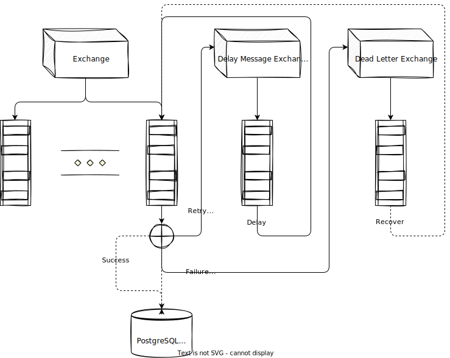

# PQX

PQX stands for Priority Queue Execution. Inspired by [the official tutorial](https://www.rabbitmq.com/tutorials/tutorial-six-python.html), PQX-APP uses RabbitMQ as the message system, and serves as a RPC client which pulls messages from MQ and deserialize messages then executes commands.

Retry functionality is based on RabbitMQ plugin `delayed_message_exchange`, check [this](https://github.com/rabbitmq/rabbitmq-delayed-message-exchange) for more detail.

A full command in Json expression looks like this:

```json
{
    "consumer_ids": ["h1", "h3"],
    "retry": 5,
    "poke": 60,
    "waiting_timeout": 180,
    "consuming_timeout": 270,
    "cmd": {
        "CondaPython": {
            "env": "py310",
            "dir": "$HOME/Code/pqx/scripts",
            "script": "print_csv_in_line.py"
        }
    }
}
```

where:

- `consumer_ids` means which consumer to receive this message;

- `retry` the number of retries, default `0`;

- `poke` retry frequency in seconds;

- `waiting_timeout` the message lives in the queue (in seconds), default infinity;

- `consuming_timeout` the `acking` timeout in a consumer (in seconds);

- `cmd` the command wants to be executed, for more detail see `CmdArg` in [adt.rs](./pqx/src/ec/cmd.rs).

<details>
<summary>and the full definition in Rust:</summary>

```rs
pub struct Command {
    pub consumer_ids: Vec<String>,
    pub retry: Option<u8>,
    pub poke: Option<u16>,
    pub waiting_timeout: Option<u32>,
    pub consuming_timeout: Option<u32>,
    pub cmd: CmdArg,
}

pub enum CmdArg {
    Ping {
        addr: String,
    },
    Bash {
        cmd: Vec<String>,
    },
    Ssh {
        ip: String,
        user: String,
        cmd: Vec<String>,
    },
    Sshpass {
        ip: String,
        user: String,
        pass: String,
        cmd: Vec<String>,
    },
    CondaPython {
        env: String,
        dir: String,
        script: String,
    },
    DockerExec {
        container: String,
        cmd: Vec<String>,
    },
}
```

</details>

## Project Structure

- `pqx-util`: utilities

  - `cfg`: config and misc

  - `db`: persistent connection

  - `logging`: logging utils

  - `mq`: RabbitMQ management APIs

- `pqx`: library

  - `ec`: commands and executors

  - `mq`: publisher and subscriber

- `pqx-app`: applications

  - `initiator`: check existences | create tables | declare exchanges, queues and etc.

  - `subscriber`: app

```txt
.
├── pqx
│   └── src
│       ├── ec
│       │   ├── cmd.rs
│       │   ├── exec.rs
│       │   ├── mod.rs
│       │   └── util.rs
│       ├── mq
│       │   ├── client.rs
│       │   ├── consumer.rs
│       │   ├── mod.rs
│       │   ├── predefined.rs
│       │   ├── publish.rs
│       │   └── subscribe.rs
│       ├── error.rs
│       └── lib.rs
├── pqx-app
│   └── src
│       ├── bin
│       │   ├── initiator.rs
│       │   ├── rectifier.rs
│       │   └── subscriber.rs
│       ├── entities
│       │   ├── message_history.rs
│       │   ├── message_result.rs
│       │   └── mod.rs
│       ├── adt.rs
│       ├── cfg.rs
│       ├── exec.rs
│       ├── lib.rs
│       └── persist.rs
├── pqx-util
│   └── src
│       ├── db.rs
│       ├── error.rs
│       ├── lib.rs
│       ├── log.rs
│       ├── misc.rs
│       └── mq.rs
└── LICENSE
```

## Message flow (Pqx-app)



## Quick startup

### Tests

1. Build image for RabbitMQ (including plugins): `make facilities-build`

1. Make sure RabbitMQ and PostgreSQL has been started, simply by executing `make facilities-setup`. Check [docker-compose](./docker/facilities/docker-compose.yml) for composing detail.

1. Add RabbitMQ user: `make mq-adduser`; for supervisor role (enable website operation): `make mq-supervisor`

1. Running the test cases

### Deploy

1. Following the same steps described in [Tests](#tests)

1. Build image for Pqx: `make pqx-build`

1. Follow the template files under `./docker/server/config`, create config files: `conn.yml` & `init.yml`.

1. Build and run a Pqx container: `make pqx-build` then `make pqx-setup`

1. Check container & initialization's availability: `docker exec pqx-dev initiator -o insp`

1. Create tables for message persistence and declare exchanges, queues and bindings: `docker exec pqx-dev initiator -o init`

## Test cases

- [cmd](./pqx/tests/test_cmd.rs): `cmd` module, commands composition and execution

- [mq](./pqx/tests/test_mq.rs): `mq` module, basic pub/sub

- [subscriber](./pqx/tests/test_subscriber.rs): pub/sub combined with a command executor

- [dlx](./pqx/tests/test_dlx.rs): dead letter exchange

- [topics](./pqx/tests/test_topics.rs): topic exchange

- [headers](./pqx/tests/test_headers.rs): header exchange

- [custom consumer](./pqx/tests/test_consumer.rs): a further test case from [subscriber](./pqx/tests/test_subscriber.rs), with custom consumer, command execution and logging. Moreover, a [Python script](./scripts/test_consumer_pub.py) for message publishing is also provided.

- [callback registration](./pqx/tests/test_callback.rs): connection & channel callback registration

- [delay retry](./pqx/tests/test_retry.rs): based on plugin [delayed_message_exchange](https://github.com/rabbitmq/rabbitmq-delayed-message-exchange), implementation of message retry

- [message persistence](./pqx-app/tests/test_persistence.rs): database interaction

- [mq api](./pqx-util/tests/test_mq.rs): RabbitMQ management APIs

## Todo

- Module `dynamic`: dynamically set/del exchange/queue/binding.
